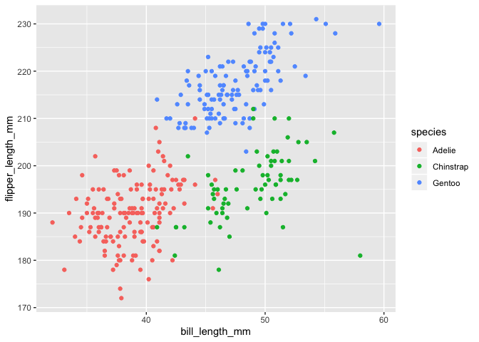

Untitled
================
Yue Chen

## Problem 1

``` r
library(tidyverse)
```

    ## ── Attaching packages ───────────────────────────────────────────────────────────────── tidyverse 1.3.0 ──

    ## ✓ ggplot2 3.2.1     ✓ purrr   0.3.4
    ## ✓ tibble  3.0.3     ✓ dplyr   0.8.3
    ## ✓ tidyr   1.0.0     ✓ stringr 1.4.0
    ## ✓ readr   1.3.1     ✓ forcats 0.4.0

    ## Warning: package 'tibble' was built under R version 3.6.2

    ## Warning: package 'purrr' was built under R version 3.6.2

    ## ── Conflicts ──────────────────────────────────────────────────────────────────── tidyverse_conflicts() ──
    ## x dplyr::filter() masks stats::filter()
    ## x dplyr::lag()    masks stats::lag()

Create a data frame with the specified elements.

``` r
df1 = tibble(
  samp = rnorm(10),
  char_vec = c("a", "b", "c", "d", "e", "f", "g", "h", "i", "j"),
  samp_gt_0 = samp > 0,
  factor_vec = factor(c("A", "B", "C", "A", "B", "C", "A", "B", "C", "A")))   
```

Take the mean of each variable in data
    frame.

``` r
mean(pull(df1, samp))
```

    ## [1] -0.1088835

``` r
mean(pull(df1, samp_gt_0))
```

    ## [1] 0.6

``` r
mean(pull(df1, char_vec))
```

    ## Warning in mean.default(pull(df1, char_vec)): argument is not numeric or
    ## logical: returning NA

    ## [1] NA

``` r
mean(pull(df1, factor_vec))
```

    ## Warning in mean.default(pull(df1, factor_vec)): argument is not numeric or
    ## logical: returning NA

    ## [1] NA

I can take the mean of numbers and logical vectors but not character or
factor.

``` r
as.numeric(pull(df1, samp))
```

    ##  [1] -0.39310706  0.71559163  0.47900838 -0.43571729  0.40405270 -1.30614231
    ##  [7]  0.08947874  0.53679221 -1.28921856  0.11042695

``` r
as.numeric(pull(df1, samp_gt_0))
```

    ##  [1] 0 1 1 0 1 0 1 1 0 1

``` r
as.numeric(pull(df1, char_vec))
```

    ## Warning: NAs introduced by coercion

    ##  [1] NA NA NA NA NA NA NA NA NA NA

``` r
as.numeric(pull(df1, factor_vec))
```

    ##  [1] 1 2 3 1 2 3 1 2 3 1

Convert logical vector to numeric, and multiply the random sample by the
result.

``` r
as.numeric(pull(df1,samp_gt_0)) * pull(df1, samp)
```

    ##  [1] 0.00000000 0.71559163 0.47900838 0.00000000 0.40405270 0.00000000
    ##  [7] 0.08947874 0.53679221 0.00000000 0.11042695

Convert logical vector to a factor, and multiply the random sample by
the
    result.

``` r
as.factor(pull(df1,samp_gt_0)) * pull(df1, samp)
```

    ## Warning in Ops.factor(as.factor(pull(df1, samp_gt_0)), pull(df1, samp)): '*' not
    ## meaningful for factors

    ##  [1] NA NA NA NA NA NA NA NA NA NA

I cannot multiply a factor to numbers.

Convert logical vector to a factor and then convert the result to
numeric, and multiply the random sample by the
    result

``` r
as.numeric(as.factor(pull(df1, samp_gt_0))) * pull(df1, samp)
```

    ##  [1] -0.3931071  1.4311833  0.9580168 -0.4357173  0.8081054 -1.3061423
    ##  [7]  0.1789575  1.0735844 -1.2892186  0.2208539

## Problem 2

``` r
data("penguins", package = "palmerpenguins")
```

``` r
summary(penguins)
```

    ##       species          island    bill_length_mm  bill_depth_mm  
    ##  Adelie   :152   Biscoe   :168   Min.   :32.10   Min.   :13.10  
    ##  Chinstrap: 68   Dream    :124   1st Qu.:39.23   1st Qu.:15.60  
    ##  Gentoo   :124   Torgersen: 52   Median :44.45   Median :17.30  
    ##                                  Mean   :43.92   Mean   :17.15  
    ##                                  3rd Qu.:48.50   3rd Qu.:18.70  
    ##                                  Max.   :59.60   Max.   :21.50  
    ##                                  NA's   :2       NA's   :2      
    ##  flipper_length_mm  body_mass_g       sex           year     
    ##  Min.   :172.0     Min.   :2700   female:165   Min.   :2007  
    ##  1st Qu.:190.0     1st Qu.:3550   male  :168   1st Qu.:2007  
    ##  Median :197.0     Median :4050   NA's  : 11   Median :2008  
    ##  Mean   :200.9     Mean   :4202                Mean   :2008  
    ##  3rd Qu.:213.0     3rd Qu.:4750                3rd Qu.:2009  
    ##  Max.   :231.0     Max.   :6300                Max.   :2009  
    ##  NA's   :2         NA's   :2

The data frame contains 8 variables including species, island,
bill\_length\_mm, bill\_depth\_mm, flipper\_length\_mm, body\_mass\_g,
sex, year of 344 penguins. Species is a factor vector, with levels
Adelie, Chinstrap, Gentoo. Island is a factor vector, with levels
Biscoe, Dream, Torgersen. Bill\_length\_mm is a numeric vector, with
range of 32.1, 59.6 mm and mean of 43.9219298 mm. Bill\_depth\_mm is a
numeric vector, with range of 13.1, 21.5 mm and mean of 43.9219298 mm.
Flipper\_length\_mm is a integer vector, with range of 172, 231 mm and
mean of 200.9152047 mm. Body\_mass\_g is a integer vector, with range of
2700, 6300 g and mean of 4201.754386 g. There were 165 female penguins
and 168 penguins. 11 penguins’ sex are
unknown.

``` r
ggplot(penguins, aes(x = bill_length_mm, y = flipper_length_mm, color = species)) + geom_point()
```

    ## Warning: Removed 2 rows containing missing values (geom_point).

<!-- -->

``` r
ggsave("scatterplot1.pdf")
```

    ## Saving 7 x 5 in image

    ## Warning: Removed 2 rows containing missing values (geom_point).
